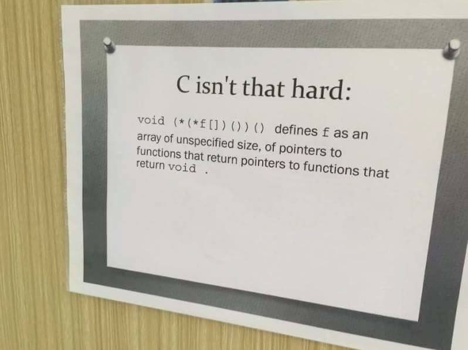

# 0x05. C - Pointers, arrays and strings

## Author:
* **Noah Tsegay** <[Noaht8](https://github.com/Noaht8)>  &#128511;

## Directory Contents
___

This directory contains the following files:

## [0-reset_to_98.c](0-reset_to_98.c)
## [1-swap.c](1-swap.c)
